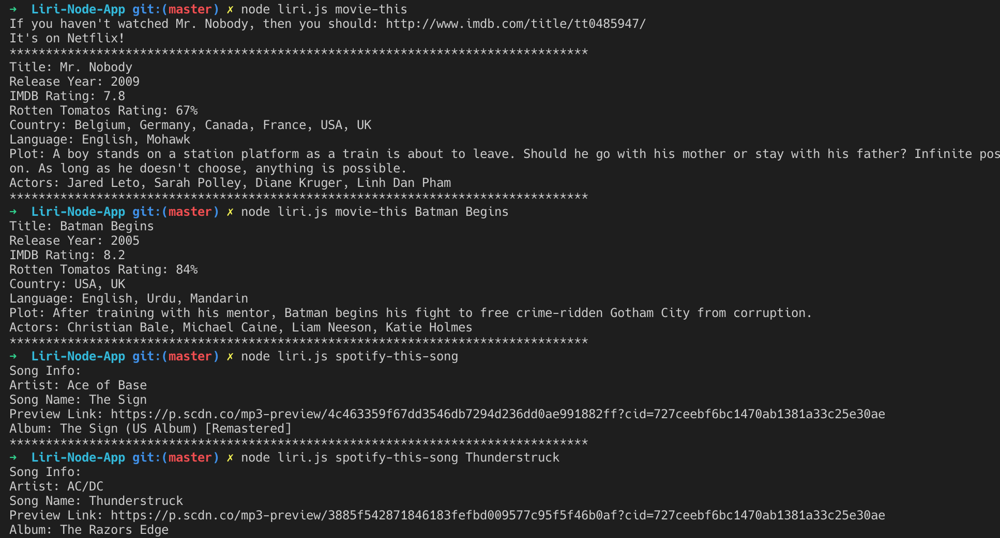
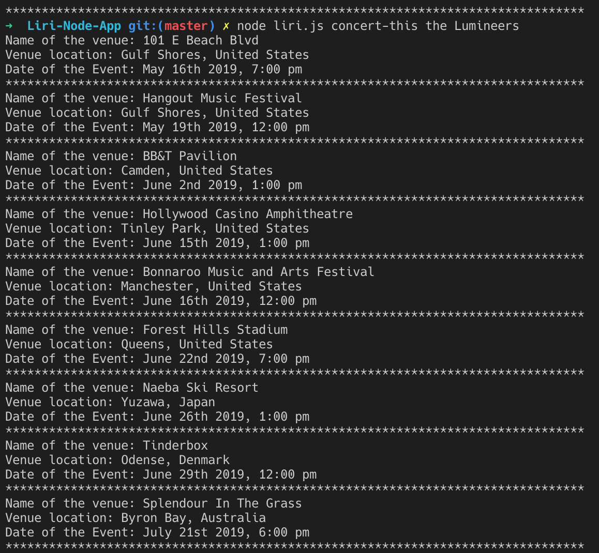

# Liri-Node-App
App that pulls info from Spotify, Bands in Town and OMDB

## Purpose:
LIRI is a Language Interpretation and Recognition Interface. LIRI will be a command line node app that takes in parameters and gives you back data.

## Product Features

## How it works:
Launch the app with node liri.js
Choose one of these commands: 
* concert-this 'add your favorite band'
* spotify-this-song 'add your favorite song'
* movie-this 'add your favorite movie'
* do-what-it-says 'no need to add, this will read and return info from another random file'

## Functionality to add:
* Add inquirer to prompt user for commands
* Print the data to a log file

## Contributors:
I, Brad Hoffman, am the sole contributor to this site.